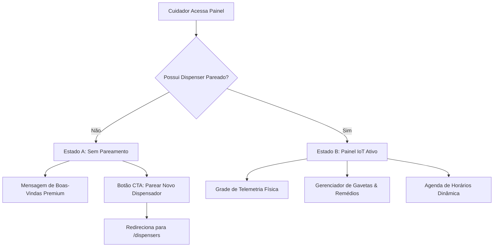

# 📊 Plano de Redesenho do Painel Principal (Dashboard IoT)

Este documento apresenta o planejamento completo para o redesenho e a reestruturação da tela principal (**Painel**) do aplicativo Smart Dispenser. A tela deixará de exibir a interface experimental de teste de LED anterior para se tornar um **Centro de Controle IoT Completo**, adaptando-se dinamicamente conforme a existência ou não de dispositivos pareados.

---

## 🔌 1. Fluxo de Estados do Painel

O painel operará em dois estados principais no frontend, controlados pela busca do perfil e dispensers do paciente selecionado:



---

## 🎨 2. Especificação da UI/UX de cada Estado

### 🔹 Estado A: Sem Pareamento (Empty State)
Quando o cuidador logar e o paciente selecionado não tiver nenhum dispenser registrado em `patient.dispensers`, o Painel exibirá um design limpo e inspirador:
1. **Visual Premium (Glassmorphism):**
   * Fundo escuro sutil com gradiente radial verde-esmeralda e grid geométrico leve.
   * Ícone centralizado de alta fidelidade: `ph-duotone ph-plugs-crossed` pulsando suavemente em gradiente.
2. **Textos Amigáveis:**
   * **Título:** *"Seu Smart Dispenser não está pareado"*
   * **Subtítulo:** *"Para monitorar medicamentos, controlar gavetas e receber telemetrias em tempo real, conecte o seu primeiro dispositivo físico."*
3. **Chamada de Ação (CTA):**
   * Botão proeminente com estilo Pillar: **"Parear Novo Dispensador"**, que direciona o usuário para `/dispensers` (onde fica a tela de busca mDNS/Wi-Fi).

---

### 🔸 Estado B: Painel IoT Ativo (Centro de Controle)
Quando houver um dispenser pareado, a tela se transforma em um dashboard de monitoramento e edição em tempo real, dividido em três painéis principais:

#### Seção 1: Cartões de Saúde do Hardware (ESP32)
Exibição de métricas físicas em formato de grade responsiva (Bento Grid):
* **Status Conectividade:** Badge pulsante `Conectado` (verde) ou `Indisponível` (vermelho).
* **Estoque de Pílulas:** Badge de alerta caso o nível esteja crítico em alguma gaveta (`critical_stock: true`).
* **Telemetria Básica:** Exibição do IP local atribuído ao ESP32 e a data/hora do último sincronismo físico (`last_sync`).

#### Seção 2: Gavetas e Posições (`Drawers` / `Slots`)
Interface tátil ilustrando os compartimentos internos do Smart Dispenser:
* **Representação Visual das Gavetas:** seçoes da coroa circular que simulam a estrutura física do dispenser (ex: Slot 1, Slot 2, ..  .).
* **Campos em Cada Gaveta:**
  * **Medicamento associado:** Nome e dosagem (ex: *Aspirina 100mg*). Se vazio, exibe *[Compartimento Vazio]*.
  * **Contagem de Estoque:** Barra de progresso visual mostrando a quantidade atual versus a capacidade máxima (ex: `15 / 30 pílulas`).
* **Botão "Editar Gaveta" (Tudo Editável):**
  * Abre um formulário modal permitindo ao cuidador:
    * Alterar o medicamento associado (dropdown dinâmico puxando `/api/medications`).
    * Ajustar a quantidade de pílulas atual (ideal para quando o cuidador reabastece a gaveta).
    * Atualizar a capacidade máxima recomendada.

#### Seção 3: Horários e Agendamentos de Dispensação (`Schedules`)
Central de controle temporal de quando as pílulas de cada gaveta devem ser ejetadas pelo servo motor do ESP32:
* **Linha do Tempo Cronológica:** Lista dinâmica dos horários programados.
* **Informações por Cartão de Horário:**
  * Hora da dose (ex: `08:00`, `20:00`).
  * Nome do medicamento e quantidade de pílulas por dosagem (ex: *1 comprimido*).
  * **Switch Ativo/Inativo:** Toggle visual para suspender ou ativar o alarme sem precisar excluí-lo.
* **Ações de Edição:**
  * **Botão "Adicionar Horário":** Abre formulário para definir hora, selecionar qual gaveta/slot e definir a quantidade de comprimidos por dose.
  * **Botão "Editar":** Altera horários e dosagens de registros existentes.
  * **Botão "Remover":** Exclui o agendamento de forma permanente.

---

## 🔗 3. Mapeamento de Rotas e APIs Envolvidas

Para tornar todos os dados editáveis e salvar as modificações no banco de dados, utilizaremos as seguintes integrações de rotas com o backend FastAPI:

### 1. Dados do Dispenser e Telemetria
* **Carregar Dispenser Ativo:** `GET /api/patients` (procura no campo `dispensers` do paciente logado).
* **Status Físico:** `GET /api/dispensers/{hardware_id}/status` (para obter online e estoque crítico).

### 2. Edição de Gavetas (Slots)
* **Buscar Estrutura das Gavetas:** `GET /api/dispensers/{id}` (inclui relacionamentos de `drawers` e seus `slots`).
* **Salvar Alteração da Gaveta:** `PATCH /api/slots/{slot_id}`
  * **Payload:**
    ```json
    {
      "medication_id": 4,
      "current_pill_count": 28,
      "max_pill_capacity": 30
    }
    ```

### 3. Gerenciamento de Agendamentos (Schedules)
* **Listar Horários:** `GET /api/schedules`
* **Criar Novo Horário:** `POST /api/schedules`
  * **Payload:**
    ```json
    {
      "slot_id": 2,
      "medication_id": 4,
      "scheduled_time": "08:00:00",
      "pills_per_dose": 1,
      "is_active": true
    }
    ```
* **Atualizar Horário Existente:** `PATCH /api/schedules/{schedule_id}` (usado para salvar alterações de hora, dose ou o estado de ativação do toggle).
* **Excluir Horário:** `DELETE /api/schedules/{schedule_id}`

---

## 📝 4. Cronograma de Ações e Checklist de Telas

- [ ] **Modificar `DashboardPage.tsx`:**
  - [ ] Implementar verificação se existe dispenser pareado carregado no estado.
  - [ ] Criar componente de **Empty State** visualmente marcante com o botão de redirecionamento para pareamento.
- [ ] **Criar Componente de Telemetria (`TelemetryGrid.tsx`):**
  - [ ] Renderizar cartões dinâmicos de Conectividade e Estoque Crítico.
- [ ] **Criar Seção de Compartimentos (`CompartmentsSection.tsx`):**
  - [ ] Desenhar o layout das gavetas como cartões de gaveta de remédio.
  - [ ] Implementar Modal para reabastecimento (*Refill*) e troca de medicamentos nas gavetas.
- [ ] **Criar Painel de Agendamentos (`SchedulesPanel.tsx`):**
  - [ ] Renderizar lista de alarmes cronológicos.
  - [ ] Adicionar modal de cadastro e edição de horário integrado com a rota `/api/schedules`.
  - [ ] Conectar o toggle `is_active` para chamar a API PATCH instantaneamente.
