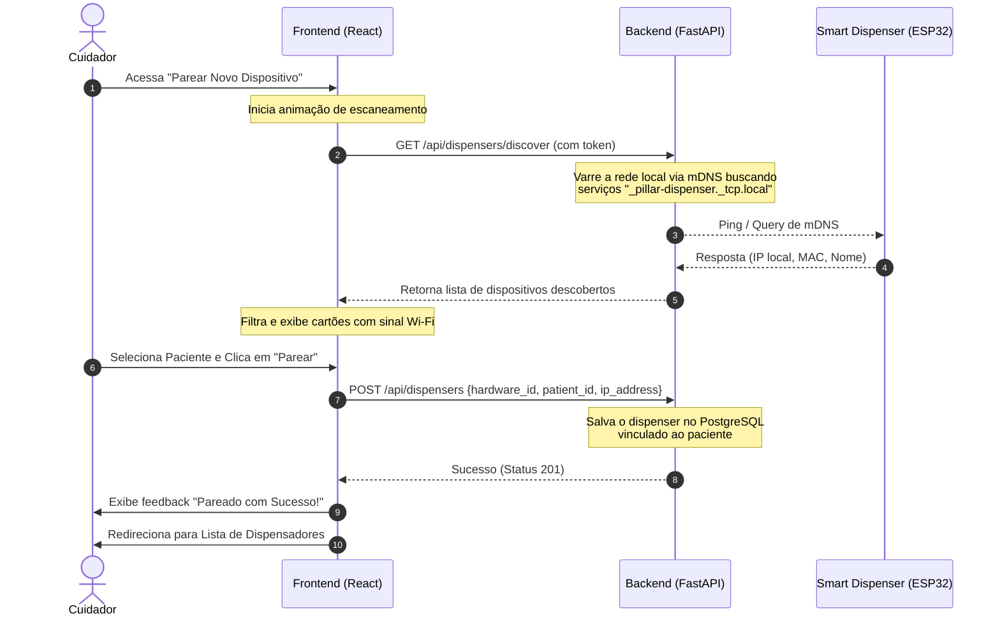

# 📡 Plano de Implementação: Integração e Pareamento do Smart Dispenser (ESP32)

Este documento apresenta o planejamento detalhado para integrar o hardware **ESP32 (Smart Dispenser)** com o ecossistema backend (**FastAPI**) e frontend (**React**), cobrindo o fluxo de descoberta, pareamento guiado, vinculação a pacientes e status de conectividade em tempo real.

---

## 🚀 1. Arquitetura de Descoberta e Pareamento

Para que o aplicativo Web consiga parear um novo dispositivo físico de forma confiável, propomos um fluxo baseado em **mDNS (Multicast DNS)** e **SoftAP (Wi-Fi Access Point)**, que são os padrões de mercado para IoT.

### O Melhor Indicador de Identidade do Dispositivo
Recomendamos utilizar o **MAC Address** ou o **Chip ID** do ESP32 como o identificador único primário (**`hardware_id`**), com um prefixo de rede claro:
* **Prefixos Filtrados:** `PillarDispenser_XXXXXX` ou `ESP32_XXXXXX` (onde `XXXXXX` são os últimos 6 caracteres do MAC Address).
* **Vantagem:** Evita expor redes Wi-Fi ou dispositivos domésticos comuns (como TVs ou roteadores) na busca do cuidador.



---

## 🛠️ 2. Especificação das APIs do Backend

Novos endpoints a serem implementados em `backend/app/api/endpoints/dispensers.py` para dar suporte ao fluxo de pareamento:

### 1. Descoberta de Dispositivos Próximos
* **Endpoint:** `GET /api/dispensers/discover`
* **Autenticação:** Requer token do cuidador.
* **Descrição:** Faz a varredura mDNS por 3 segundos na rede local do backend e retorna dispositivos não pareados que possuem o prefixo de identificação correspondente.
* **Exemplo de Retorno:**
  ```json
  [
    {
      "hardware_id": "ESP32_C3_98A4",
      "ip_address": "192.168.109.112",
      "ssid": "PillarDispenser_98A4",
      "signal_strength": -65,
      "model": "Pillar SmartDispenser V1"
    }
  ]
  ```

### 2. Cadastro e Vínculo com Paciente
* **Endpoint:** `POST /api/dispensers`
* **Autenticação:** Requer token do cuidador.
* **Payload:**
  ```json
  {
    "hardware_id": "ESP32_C3_98A4",
    "name": "Dispensador Quarto Principal",
    "patient_id": "3fa85f64-5717-4562-b3fc-2c963f66afa6",
    "ip_address": "192.168.109.112"
  }
  ```
* **Descrição:** Cria o registro no banco de dados e associa o dispenser ao `patient_id`.

### 3. Remoção de Pareamento (Exclusão)
* **Endpoint:** `DELETE /api/dispensers/{hardware_id}`
* **Autenticação:** Requer token do cuidador.
* **Descrição:** Desvincula o dispenser do paciente e remove o registro do banco de dados.

---

## 🎨 3. Design de UI/UX do Pareamento no Frontend

### Tela "Parear novo dispositivo" (`frontend/src/pages/PairDispenserPage.tsx`)
1. **Fase de Busca (Automática ao Entrar):**
   * Exibir uma animação circular pulsante de alta fidelidade visual (Glassmorphism + gradiente suave em tons esmeralda/azul).
   * Texto indicativo: *"Buscando dispositivos Pillar próximos... Certifique-se de que o dispenser está ligado e no modo de pareamento."*
   
2. **Listagem de Dispositivos Encontrados:**
   * Cartões minimalistas para cada dispositivo contendo:
     * Ícone de sinal Wi-Fi (`ph-duotone ph-wifi-high`).
     * Nome amigável: `Pillar Dispenser (98A4)`.
     * Status: `Pronto para Conectar`.
     * Botão com estilo Pillar: `Parear dispositivo`.

3. **Modal/Formulário de Vinculação:**
   * Ao clicar em "Parear dispositivo", abre-se uma gaveta ou modal elegante para:
     * Selecionar o Paciente que utilizará o dispositivo (Dropdown dinâmico alimentado pela chamada real `/api/patients`).
     * Nomear o dispositivo (ex: *"Cabeceira do Quarto"*).
     * Confirmar e salvar.

### Tela "Dispensadores" (`frontend/src/pages/DispensersPage.tsx`)
Para substituir a listagem estática atual por dados reais:
* **Requisição:** `GET /api/dispensers` na montagem da tela (`useEffect`).
* **Indicador de Conexão em Tempo Real:**
  * O backend faz uma requisição ultra-rápida (com timeout de 800ms) ao IP de cada dispenser cadastrado (`GET http://{esp_ip}/status`).
  * Se o ESP32 responder, retorna `hardwareReachable: true` (Exibe Badge Verde: `Conectado`).
  * Se falhar, retorna `hardwareReachable: false` (Exibe Badge Vermelha: `Indisponível`).

---

## 📝 4. Cronograma de Atividades e Checklist de Implementação

### 🟩 Fase 1: Firmware do ESP32 (C++)
- [ ] Implementar mDNS responder no firmware do ESP32 usando a biblioteca `ESPmDNS.h`.
- [ ] Registrar o serviço do dispenser como `_pillar-dispenser._tcp`.
- [ ] Adicionar endpoint `/status` no ESP32 retornando informações em formato JSON (por exemplo, slot atual, RSSI, reservatório de pílulas).

### 🟦 Fase 2: Backend (FastAPI)
- [ ] Adicionar dependência `zeroconf` no `requirements.txt` para detecção de serviços mDNS locais.
- [ ] Criar o endpoint de descoberta `GET /api/dispensers/discover` executando a varredura local.
- [ ] Implementar o modelo SQLAlchemy e o endpoint de vinculação `POST /api/dispensers`.
- [ ] Adicionar rota de exclusão/despareamento `DELETE /api/dispensers/{hardware_id}`.
- [ ] Adicionar verificação de saúde (`ping` HTTP) dos ESP32s conectados no endpoint de listagem de dispensers.

### 🟨 Fase 3: Frontend (React)
- [ ] Implementar busca ativa via `useEffect` ao entrar na página de pareamento.
- [ ] Adicionar dropdown dinâmico buscando os pacientes cadastrados no banco de dados.
- [ ] Conectar os botões de ação ("Parear", "Excluir") aos respectivos endpoints REST da API FastAPI.
- [ ] Tratar cenários onde nenhum dispositivo é encontrado com telas amigáveis e botão de "Tentar Novamente".
