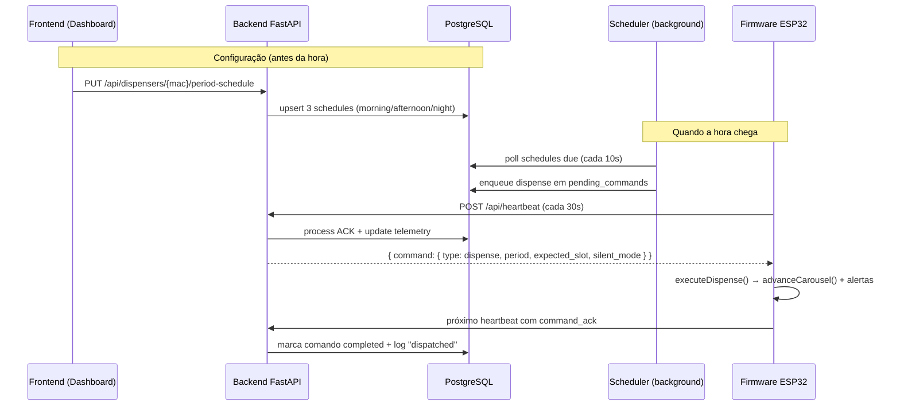

# Fluxo completo de dispensação — mapa para revisão e testes

Documento de referência para validar toda a cadeia de comunicação: do horário configurado no dashboard até a ativação física do servo no ESP32.

**Última revisão do código:** junho/2026

---

## 1. Visão geral da arquitetura

O sistema **não agenda horários no firmware**. O ESP32 apenas:

1. Envia telemetria e recebe comandos via **heartbeat HTTP** (a cada 30 s).
2. Expõe endpoints HTTP locais para testes e modo dev (`/dispense`, `/status`, etc.).

O **backend** (FastAPI + PostgreSQL) é quem:

- Persiste os horários (manhã / tarde / noite).
- Roda um scheduler em background que detecta quando a hora chegou.
- Enfileira comandos `dispense` na tabela `pending_commands`.
- Entrega esses comandos na resposta do heartbeat.



**Protocolos usados:** HTTP (ESP ↔ backend, frontend ↔ backend, frontend ↔ ESP na LAN). Não há MQTT nem controle de dispensação por serial.

---

## 2. Camada por camada

### 2.1 Frontend — configurar horários

| Arquivo | Responsabilidade |
|---------|------------------|
| `frontend/src/components/dashboard/PeriodScheduleSection.tsx` | UI de horários manhã/tarde/noite + modo silencioso |
| `frontend/src/lib/api.ts` | `savePeriodSchedule()`, `getPeriodSchedule()`, `startDispenserCycle()` |
| `frontend/src/components/dashboard/UnsavedScheduleBanner.tsx` | Avisa que horários padrão **não disparam** o servo até salvar |

**Fluxo:**

1. Cuidador define `morning_time`, `afternoon_time`, `night_time` e `silent_mode`.
2. `PUT /api/dispensers/{hardware_id}/period-schedule` persiste no banco.
3. **Importante:** sem salvar, o scheduler ignora os defaults exibidos na UI — só servem de prévia no countdown.

### 2.2 Backend — persistência de schedules

| Arquivo | Responsabilidade |
|---------|------------------|
| `backend/app/api/endpoints/dispensers.py` | `put_period_schedule()`, `get_period_schedule()` |
| `backend/app/crud/schedule.py` | `upsert_period_schedules()` — 3 linhas `Schedule` com `period` ∈ {morning, afternoon, night} |
| `backend/app/services/schedule_utils.py` | `parse_schedule_time()`, `carousel_slot_after_sequential()` |

Cada schedule guarda:

- `time_legacy` (ex.: `"08:00"`)
- `period`, `silent_mode`, `is_active`
- `dispenser_id` (MAC do hardware)
- `slot_id = None` (modelo sequencial por período, não por compartimento fixo)

### 2.3 Backend — scheduler (detecção da hora)

| Arquivo | Responsabilidade |
|---------|------------------|
| `backend/app/main.py` | Inicia `run_dispense_scheduler()` no lifespan |
| `backend/app/services/scheduler.py` | Loop principal |
| `backend/app/services/scheduler_clock.py` | `scheduler_now()` — timezone `America/Sao_Paulo` |
| `backend/app/core/config.py` | Constantes de janela e modo |

**Constantes relevantes:**

| Variável | Padrão | Significado |
|----------|--------|-------------|
| `SCHEDULER_POLL_SECONDS` | 10 | Intervalo de verificação de schedules |
| `SCHEDULER_DUE_WINDOW_SECONDS` | 120 | Janela após o horário para considerar "due" |
| `SCHEDULER_DEDUP_SECONDS` | 180 | Evita re-disparo do mesmo schedule |
| `SCHEDULER_MODE` | `queue` | `queue` (cloud) ou `push` (LAN dev) |
| `COMMAND_ACK_TIMEOUT_SECONDS` | 900 | Timeout de ACK de comando |

**Lógica `_is_due`:**

- Só schedules com `period` definido e `is_active=True`.
- Horário efetivo: `time_legacy` HH:MM — dispara **diariamente**.
- Janela: de 0 s antes até +120 s após o horário.
- Deduplicação via `last_triggered_at`.
- Bloqueio se `dispenser.awaiting_confirm` (exceto flag lab `SCHEDULER_IGNORE_AWAITING_CONFIRM`).

**Dois modos de entrega:**

| Modo | Comportamento | Quando usar |
|------|---------------|-------------|
| **`queue`** (padrão) | `enqueue_dispense()` → fila `pending_commands` → heartbeat entrega | Produção / cloud |
| **`push`** | `POST http://{ip}/dispense` direto no ESP | Dev em LAN apenas |

### 2.4 Backend — fila de comandos

| Arquivo | Responsabilidade |
|---------|------------------|
| `backend/app/crud/command_queue.py` | `enqueue_dispense()`, `get_command_for_delivery()`, `process_command_ack()` |

**`enqueue_dispense()` calcula:**

```
expected_slot = (current_slot + 1) % 21
```

Grava em `pending_commands` com `period`, `silent_mode`, `schedule_id`. Deduplica por `schedule_id` enquanto comando ativo.

### 2.5 Backend — heartbeat (entrega de comandos)

| Arquivo | Responsabilidade |
|---------|------------------|
| `backend/app/api/endpoints/iot.py` | `POST /api/heartbeat` |

**Processamento em cada heartbeat:**

1. Processa `command_ack` do heartbeat anterior (se houver).
2. Atualiza status do dispenser (`current_slot`, `awaiting_confirm`, `ip_address`, etc.).
3. Busca próximo comando pendente e retorna na resposta.
4. Marca comando como `delivered`.

---

## 3. Firmware — componentes e ativação

### 3.1 Boot e loop principal

| Arquivo | Responsabilidade |
|---------|------------------|
| `firmware/eco-dispenser/eco-dispenser.ino` | Boot, WiFi, loop principal |
| `firmware/eco-dispenser/config.h` | `TOTAL_SLOTS=21`, `HEARTBEAT_INTERVAL_MS=30000` |
| `firmware/eco-dispenser/boards/config_c3_supermini.h` | Pinos e ângulos do servo (C3) |
| `firmware/eco-dispenser/boards/config_wroom32.h` | Pinos e ângulos do servo (WROOM32) |

**Módulos inicializados no `setup()`:**

```
carouselSetup()  → servo + NVS (slot persistido)
alertsSetup()    → LEDs período, buzzer, vibração
buttonsSetup()   → botão BOOT (confirmação)
setupApiServer() → HTTP local porta 80
setBackendUrl()  → URL do backend
```

**Loop a cada ~10 ms:**

```
alertsTick()      → vibração pulsada (modo silencioso)
checkButtons()    → confirmação do paciente
sendHeartbeat()   → a cada 30 s (ou antecipado após confirmação/reconexão)
```

O servo **não** roda no loop — só quando `advanceCarousel()` é chamado.

### 3.2 Recepção de comando

| Arquivo | Responsabilidade |
|---------|------------------|
| `firmware/eco-dispenser/heartbeat_client.cpp` | `sendHeartbeat()`, `processHeartbeatCommand()` |
| `firmware/eco-dispenser/api_server.cpp` | `POST /dispense` (caminho alternativo LAN) |

**Tipos de comando no heartbeat:**

| `type` | Ação no firmware |
|--------|------------------|
| `dispense` | `executeDispense()` |
| `calibrate` | `calibrateCarousel()` + `clearAlerts()` |
| `confirm` | `clearAlerts()` (timeout backend) |

### 3.3 Cadeia de dispensação

```
processHeartbeatCommand()  ou  POST /dispense
    └── executeDispense()          [dispense_command.cpp]
            ├── [guard] isAwaitingConfirmation() → erro "awaiting_confirm"
            ├── [guard] expected_slot vs current_slot → erro "slot_mismatch"
            ├── advanceCarousel()  [carousel.cpp]  ← SERVO
            └── triggerDispenseAlert()  [alerts.cpp]
```

**`executeDispense()` — validação de slot:**

Se backend envia `expected_slot=4` e `current_slot=3` antes do avanço → OK.

```cpp
int requiredBefore = (expectedSlot - 1 + TOTAL_SLOTS) % TOTAL_SLOTS;
if (getCurrentSlot() != requiredBefore) → slot_mismatch
```

### 3.4 O que é ativado fisicamente em cada dispensação

| Componente | Arquivo | Comportamento |
|------------|---------|---------------|
| **Servo** | `carousel.cpp` → `advanceCarousel()` | Pulso 0° → avanço → 0° (ver seção 4) |
| **LED período** | `alerts.cpp` | Acende GPIO do período (manhã/tarde/noite) |
| **Buzzer** | `alerts.cpp` | 3 bipes (modo normal) |
| **Vibração** | `alerts.cpp` | Pulsos contínuos até confirmação (modo silencioso) |
| **NVS** | `carousel.cpp` | Persiste novo `current_slot` |
| **Flag** | `alerts.cpp` | `awaiting_confirm = true` (bloqueia próxima dose) |

**Confirmação do paciente** (`buttons.cpp`):

- Botão BOOT (`BTN_CONFIRM`, GPIO 3 no C3) → `clearAlerts()` + `POST /api/event` + heartbeat antecipado.

---

## 4. Servo — estado atual vs requisito físico (198°)

### 4.1 Implementação atual no código

Configuração em `config_c3_supermini.h` (e idêntica em `config_wroom32.h`, com GPIO diferente):

```cpp
const int SERVO_PIN      = 10;   // C3 — GPIO 18 no WROOM32
const int SERVO_REST     = 0;
const int SERVO_ADVANCE  = 90;
const int SERVO_DELAY_MS = 400;
```

Lógica em `carousel.cpp`:

```cpp
void advanceCarousel() {
  servo.write(SERVO_ADVANCE);   // 1ª escrita: 90°
  delay(SERVO_DELAY_MS);        // 400 ms
  servo.write(SERVO_REST);      // 2ª escrita: 0° (repouso)
  delay(SERVO_DELAY_MS);        // 400 ms

  currentSlot = (currentSlot + 1) % TOTAL_SLOTS;
  saveSlot(currentSlot);
}
```

### 4.2 Resposta direta: duas escritas em 198°?

| Pergunta | Resposta |
|----------|----------|
| Existe `198` no firmware? | **Não** — nenhuma referência a 198° como ângulo do servo |
| Quantas escritas no ângulo de avanço? | **Uma** escrita em 90°, seguida de retorno a 0° |
| Duas escritas consecutivas no mesmo ângulo? | **Não implementado** |
| Chamadas a `advanceCarousel()` por dose? | **Uma** por comando `dispense` |

**Conclusão:** se o mecanismo físico da catraca exige **dois impulsos em 198°** para liberar um compartimento, isso **não está implementado**. O firmware modela um ciclo único repouso (0°) → avanço (90°) → repouso (0°).

### 4.3 Correção sugerida (não implementada)

Se o hardware real precisa de duas escritas em 198°:

```cpp
// config_c3_supermini.h
const int SERVO_REST     = 0;    // ou ângulo de repouso real medido
const int SERVO_ADVANCE  = 198;  // ângulo da catraca

// carousel.cpp — advanceCarousel()
void advanceCarousel() {
  servo.write(SERVO_ADVANCE);   // 1º impulso
  delay(SERVO_DELAY_MS);
  servo.write(SERVO_ADVANCE);   // 2º impulso (mesmo ângulo)
  delay(SERVO_DELAY_MS);
  servo.write(SERVO_REST);
  delay(SERVO_DELAY_MS);

  currentSlot = (currentSlot + 1) % TOTAL_SLOTS;
  saveSlot(currentSlot);
}
```

> Validar no banco os valores de repouso e avanço com o hardware real antes de alterar o firmware de produção.

---

## 5. Sequência temporal — quando a hora chega

Exemplo: horário configurado **08:00**, heartbeat a cada 30 s, scheduler a cada 10 s.

```
T+0s      Horário 08:00
T+0–120s  Scheduler detecta schedule "due" (poll a cada 10s)
          → enqueue_dispense() em pending_commands
          → schedule.last_triggered_at = now

T+0–30s   ESP envia heartbeat
          → backend: get_command_for_delivery() → retorna comando dispense
          → backend: mark_delivered()
          → ESP: processHeartbeatCommand() → executeDispense()

T+~30s    ESP executa:
          1. Valida slot
          2. advanceCarousel() — servo
          3. triggerDispenseAlert() — LED/buzzer/vibração
          4. queueCommandAck()

T+~60s    Próximo heartbeat carrega ACK
          → backend: process_command_ack → status completed
          → record_schedule_dispensation_log() → log "dispatched"
          → update_dispenser_status(current_slot, awaiting_confirm)
```

**Latência máxima típica:** ~40 s após o horário (30 s heartbeat + até 10 s poll do scheduler).

---

## 6. Payloads de comunicação (para testes)

### 6.1 ESP → Backend (heartbeat)

```json
POST /api/heartbeat
{
  "dispenser_id": "AA:BB:CC:DD:EE:FF",
  "uptime_s": 3600,
  "current_slot": 3,
  "wifi_rssi": -55,
  "online": true,
  "critical_stock": false,
  "awaiting_confirm": false,
  "ip_address": "192.168.1.50",
  "command_ack": {
    "command_id": "uuid-do-comando-anterior",
    "success": true
  }
}
```

### 6.2 Backend → ESP (resposta heartbeat com comando)

```json
{
  "command": {
    "id": "550e8400-e29b-41d4-a716-446655440000",
    "type": "dispense",
    "period": "morning",
    "expected_slot": 4,
    "silent_mode": false
  }
}
```

Sem comando pendente: `"command": null`

### 6.3 Dispensação manual (LAN — bypass do scheduler)

```json
POST http://{ip_esp}/dispense
{
  "period": "morning",
  "silent_mode": false,
  "expected_slot": 4
}
```

Resposta sucesso: `{"success":true,"current_slot":4}`

Resposta erro slot: HTTP 409 `{"success":false,"error":"slot_mismatch","current_slot":2,"expected_slot":4}`

### 6.4 Status do ESP

```
GET http://{ip_esp}/status
```

### 6.5 Confirmação do paciente

```
POST http://{ip_esp}/confirm
```

Ou botão BOOT na placa → `clearAlerts()` + evento ao backend.

---

## 7. Checklist de testes de comunicação

Use esta lista para validar cada elo da cadeia. Marque ✅ conforme verificar.

### 7.1 Configuração (frontend → backend)

- [ ] Salvar horários no dashboard (`PUT period-schedule`) retorna 200
- [ ] `GET period-schedule` retorna os 3 períodos salvos
- [ ] Banner de "horários não salvos" some após salvar
- [ ] `is_active=true` nos schedules no banco

### 7.2 Scheduler (backend interno)

- [ ] Logs do scheduler mostram schedule detectado como "due" no horário
- [ ] Linha criada em `pending_commands` com `command_type=dispense`
- [ ] `expected_slot` calculado como `(current_slot + 1) % 21`
- [ ] Não re-enfileira duplicata dentro de `SCHEDULER_DEDUP_SECONDS` (180s)

### 7.3 Heartbeat (ESP ↔ backend)

- [ ] ESP envia heartbeat a cada ~30 s (Serial: `[Heartbeat] 200`)
- [ ] Backend atualiza `last_sync`, `current_slot`, `ip_address`
- [ ] Comando pendente aparece na resposta do heartbeat
- [ ] ESP loga: `[Heartbeat] ▶ comando recebido: DISPENSAR periodo=...`
- [ ] Próximo heartbeat inclui `command_ack` com `success: true`
- [ ] Backend marca comando como `completed`

### 7.4 Firmware — execução física

- [ ] Serial loga: `🎡 Avançou para slot N`
- [ ] Servo move fisicamente (ver seção 4 — ângulo pode estar errado)
- [ ] LED do período acende
- [ ] Buzzer (3 bipes) ou vibração (modo silencioso)
- [ ] `awaiting_confirm=true` no próximo heartbeat
- [ ] Botão BOOT limpa alertas e envia evento

### 7.5 Validação de slot

- [ ] Com `expected_slot` correto → dispensação OK
- [ ] Com slot desalinhado → `slot_mismatch`, servo **não** avança
- [ ] Com `awaiting_confirm=true` → `awaiting_confirm`, servo **não** avança

### 7.6 Caminho alternativo LAN

- [ ] `POST /dispense` direto no IP do ESP funciona
- [ ] `GET /status` retorna `current_slot` coerente
- [ ] `POST /calibrate` reseta para slot 0

### 7.7 Confirmação e dose perdida

- [ ] Sem confirmação em 120s → backend enfileira comando `confirm`
- [ ] Log de dispensation registra "missed" quando aplicável

### 7.8 Testes automatizados existentes

```bash
# Backend
cd backend && pytest tests/test_scheduler.py tests/test_command_queue.py tests/test_iot.py -v

# Firmware (requer ESP na rede)
cd firmware/tests && pytest test_motor.py test_api_schema.py -v
```

---

## 8. Índice de arquivos-chave

| Camada | Caminho | Responsabilidade |
|--------|---------|------------------|
| UI | `frontend/src/components/dashboard/PeriodScheduleSection.tsx` | Salvar horários |
| API client | `frontend/src/lib/api.ts` | Chamadas REST |
| LAN direto | `frontend/src/lib/espLocal.ts` | Status/calibrate no IP local |
| Scheduler | `backend/app/services/scheduler.py` | Detectar hora + enfileirar |
| Fila | `backend/app/crud/command_queue.py` | `pending_commands` |
| Heartbeat API | `backend/app/api/endpoints/iot.py` | Entregar comandos + ACK |
| Schedules CRUD | `backend/app/crud/schedule.py` | Persistir períodos |
| Config | `backend/app/core/config.py` | Constantes do scheduler |
| Boot/loop | `firmware/eco-dispenser/eco-dispenser.ino` | Heartbeat 30s |
| Heartbeat | `firmware/eco-dispenser/heartbeat_client.cpp` | Pull de comandos |
| Dispensação | `firmware/eco-dispenser/dispense_command.cpp` | Orquestração |
| Servo | `firmware/eco-dispenser/carousel.cpp` | `advanceCarousel()` |
| Config servo | `firmware/eco-dispenser/boards/config_c3_supermini.h` | Pinos e ângulos |
| Alertas | `firmware/eco-dispenser/alerts.cpp` | LED/buzzer/vibração |
| Botão | `firmware/eco-dispenser/buttons.cpp` | Confirmação paciente |
| HTTP local | `firmware/eco-dispenser/api_server.cpp` | `/dispense`, `/status` |
| Teste HW | `firmware/hardware_test/hardware_test.ino` | Teste isolado de periféricos |

---

## 9. Lacunas e pontos de atenção

| # | Severidade | Descrição |
|---|------------|-----------|
| 1 | **Crítico** | Servo usa 90° com escrita única no avanço — **não** 198° com dupla escrita. Provável causa de slot não liberar fisicamente. |
| 2 | Alta | Latência de até ~40s entre horário e dispensação (heartbeat 30s + scheduler 10s). |
| 3 | Média | ESP não agenda offline — depende do backend online. `GET /api/sync` existe mas firmware não consome. |
| 4 | Média | Horários não salvos no dashboard não disparam — fácil de esquecer. |
| 5 | Média | `awaiting_confirm` bloqueia próxima dose até confirmação ou timeout (120s). |
| 6 | Baixa | Modo `push` não funciona em cloud (IP privado do ESP). Usar `queue`. |
| 7 | Baixa | Sem sensor de ejeção — software incrementa slot sem verificar comprimido. |
| 8 | Baixa | DB cria 31 slots no drawer; firmware usa 21 (`TOTAL_SLOTS`). |
| 9 | Info | `hardware_test.ino` ainda referencia GPIO 8 para servo (desatualizado vs config atual GPIO 10). |

---

## 10. Comandos rápidos para debug

```bash
# Ver status do ESP na LAN
curl -s http://<IP_ESP>/status | jq

# Dispensar manualmente (lab)
curl -s -X POST http://<IP_ESP>/dispense \
  -H "Content-Type: application/json" \
  -d '{"period":"morning","silent_mode":false,"expected_slot":1}' | jq

# Calibrar roleta
curl -s -X POST http://<IP_ESP>/calibrate | jq

# Confirmar paciente
curl -s -X POST http://<IP_ESP>/confirm | jq

# Monitorar Serial do ESP (115200 baud)
# Procurar: [Heartbeat], 🎡 Avançou para slot, [Alerts]
```

---

## 11. Próximo passo recomendado

1. **Confirmar no hardware** os ângulos reais de repouso e avanço da catraca (198°? outro valor?).
2. **Confirmar** se são necessários dois impulsos no mesmo ângulo ou dois ciclos completos.
3. **Atualizar** `config_c3_supermini.h` e `advanceCarousel()` conforme medição física.
4. **Testar** com `POST /dispense` na LAN antes de validar o fluxo completo via scheduler + heartbeat.
5. **Validar** checklist da seção 7 ponta a ponta.
