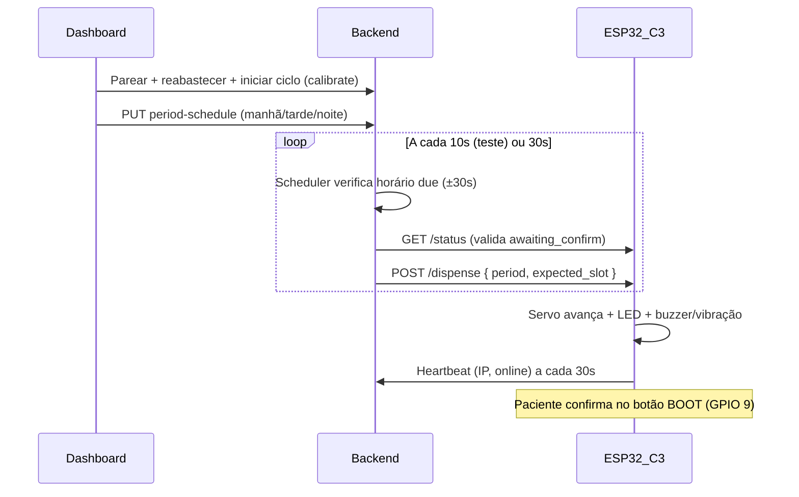

# Guia de Testes — ESP32-C3 Mini (Dispensação Sequencial)

Guia progressivo para validar firmware, hardware e integração com backend/dashboard no modelo de **dispensação sequencial** (posições 1–21).

> **Tempo estimado:** 2–3 horas na primeira passagem completa.

---

## Contexto do sistema

O SmartDispenser usa um modelo **sequencial por posição**, não um calendário genérico de medicamentos:



| Camada | Papel |
|--------|-------|
| **Firmware** (`eco-dispenser/`) | Controla hardware; **não** executa horários localmente |
| **Backend** (`scheduler.py`) | Dispara `POST /dispense` no IP recebido via heartbeat |
| **Interface** (Dashboard) | Pareamento, telemetria, compartimentos, **horários por período**, botão **Iniciar ciclo** |

---

## Pré-requisitos

### Hardware (ESP32-C3 SuperMini)

Mapeamento em [`boards/config_c3_supermini.h`](eco-dispenser/boards/config_c3_supermini.h):

| Componente | GPIO | O que observar no teste |
|------------|------|-------------------------|
| Servo SG90 (roleta) | 2 | Gira ~90° a cada dispensação |
| LED manhã | 3 | Aceso em `period: "morning"` |
| LED tarde | 4 | Aceso em `period: "afternoon"` |
| LED noite | 5 | Aceso em `period: "night"` |
| Buzzer | 21 | 3 bipes (modo normal) |
| Motor vibração | 10 | Ativo com `silent_mode: true` |
| Botão confirmar | **9** (BOOT onboard) | Limpa alerta após dispensação — **não precisa de botão externo** |
| Botões vol + / − | 6 / 7 | Opcionais (externos); segurar ambos 5 s = reset Wi-Fi |
| LED onboard | 8 | Active LOW (diagnóstico) |

### Software

1. **Arduino IDE**: board `ESP32C3 Dev Module`, USB CDC On Boot **Enabled**, core Espressif 3.0.x+ — ver [README.md](README.md)
2. **secrets.h**: copiar de [`secrets.h.example`](eco-dispenser/secrets.h.example)
   - `WIFI_SSID` / `WIFI_PASSWORD`: rede de teste (ou vazio para BLE)
   - `BACKEND_URL`: IP do host acessível pelo ESP (ex.: `http://192.168.1.100:8000`) — **não use `localhost`**
3. **Stack**: `docker compose --profile dev up --build` ou backend local na porta 8000
4. PC, ESP32 e backend na **mesma rede Wi-Fi**

### Scripts auxiliares

```bash
# Verificação rápida de conectividade (Fase 0)
./scripts/verificar-status.sh <IP_ESP>

# Sequência manual posições 1→2→3 (Fase 4)
./scripts/test-sequencia-manual.sh <IP_ESP>

# Criar schedule de teste via API (legado — por posição)
./scripts/criar-schedule-teste.sh <TOKEN> <PATIENT_ID> <MAC_ESP> [SLOT] [TIME]

# E2E integrado: start-cycle + horários manhã/tarde/noite (recomendado)
./scripts/teste-e2e-periodos.sh [fixture.json]
```

---

## Fase 0 — Flash e boot básico

**Objetivo:** confirmar que o firmware sobe e expõe HTTP.

1. Upload de [`eco-dispenser.ino`](eco-dispenser/eco-dispenser.ino)
2. Serial Monitor **115200 baud** — aguardar IP após boot
3. Anotar: IP do ESP, MAC (`hardware_id`), slot atual

```bash
./scripts/verificar-status.sh <IP_ESP>
# ou manualmente:
curl -s http://<IP_ESP>/status | jq
```

**Esperado:** `current_slot`, `total_slots: 21`, `hardware_id`, `wifi_rssi`, `awaiting_confirm: false`

**Checklist:**
- [ ] IP exibido no serial
- [ ] `/status` responde 200
- [ ] Página de diagnóstico em `http://<IP_ESP>/`

---

## Fase 1 — Testes automatizados de hardware (pytest)

**Objetivo:** validar cada módulo do firmware via HTTP, sem backend.

Suíte em [`tests/`](tests/) — ver [`tests/README.md`](tests/README.md).

```bash
cd firmware/tests && pip install -r requirements.txt
ESP32_IP=<IP_ESP> pytest ../tests/ -v
```

**Ordem recomendada (incremental):**

| Passo | Comando | Verificação física |
|-------|---------|-------------------|
| 1 | `test_connectivity.py` | — |
| 2 | `test_api_schema.py` | — |
| 3 | `test_motor.py -k "not wrap_around"` | Servo gira; slot incrementa |
| 4 | `test_leds.py -v -s` | LED correto acende por período |
| 5 | `test_alerts.py -v -s` | Buzzer ou vibração |
| 6 | `test_buttons.py` | Pressionar botão confirmar (GPIO 0) |
| 7 | `test_motor.py` (completo) | Wrap-around slot 20→0 |

**Checklist:**
- [ ] Todos os testes passam (ou skip só se ESP inacessível)
- [ ] `/calibrate` zera roleta em slot 0
- [ ] `POST /dispense` avança exatamente 1 slot
- [ ] `awaiting_confirm` vai true após dispense e false após confirm

---

## Fase 2 — Conectividade com backend (heartbeat)

**Objetivo:** dashboard mostra dispenser **conectado**; scheduler consegue alcançar o ESP.

1. Configurar `BACKEND_URL` em `secrets.h` com IP LAN do host
2. Regravar firmware (ou reconectar Wi-Fi)
3. Serial: logs `[Heartbeat] 200` a cada ~30 s
4. Registrar dispenser no backend (Fase 3) ou enviar heartbeat manual:

```bash
curl -X POST http://localhost:8000/api/heartbeat \
  -H "Content-Type: application/json" \
  -d '{"dispenser_id":"<MAC>","online":true,"ip_address":"<IP_ESP>"}'
```

5. No dashboard: status **conectado** e `last_sync` atualizado (poll a cada 5 s)

**Teste de isolamento** (heartbeat ≠ roleta): anotar `current_slot`, aguardar 2 heartbeats (~60 s), confirmar que **slot não mudou** — só muda via `/dispense`.

**Checklist:**
- [ ] Heartbeat HTTP 200 no serial
- [ ] `ip_address` persistido no banco
- [ ] Dashboard reflete online/offline

---

## Fase 3 — Interface: pareamento e compartimentos

**Objetivo:** fluxo previsto em `DispenserGuideSection` no dashboard.

1. **Subir frontend + backend:** `docker compose --profile dev up`
2. **Registrar/login** cuidador em http://localhost
3. **Criar paciente** (menu Pacientes)
4. **Parear dispenser** (`PairDispenserPage`):
   - BLE: nome `Eco-Dispenser`
   - Enviar credenciais Wi-Fi
   - Aguardar heartbeat → status conectado
5. **Dashboard** → mapa circular de compartimentos:
   - Cadastrar medicamentos nas posições 1, 2, 3 (teste mínimo)
   - Confirmar telemetria (online, paciente vinculado)

**Checklist:**
- [ ] Dispenser aparece em Dispensadores como conectado
- [ ] Dashboard carrega gavetas/slots (auto-criação de 31 slots no backend; roleta física usa 21)
- [ ] Medicamentos registrados nas posições de teste

---

## Fase 4 — Calibração e dispensação manual sequencial

**Objetivo:** validar sequência física posição 1 → 2 → 3 antes de envolver o scheduler.

> **Recomendado:** usar o botão **Concluir reabastecimento e iniciar ciclo** no dashboard (calibração automática via `POST /api/dispensers/{mac}/start-cycle`). O script manual abaixo continua útil para isolar o firmware.

```bash
./scripts/test-sequencia-manual.sh <IP_ESP>
```

Comandos equivalentes:

```bash
# 1. Zerar roleta (início da sequência)
curl -X POST http://<IP_ESP>/calibrate

# 2. Dispensar posição 1 (slot 0 → 1)
curl -X POST http://<IP_ESP>/dispense \
  -H "Content-Type: application/json" \
  -d '{"period":"morning","silent_mode":true,"expected_slot":1}'

# 3. Confirmar ingestão (botão físico OU endpoint)
curl -X POST http://<IP_ESP>/confirm

# 4. Dispensar posição 2 (slot 1 → 2)
curl -X POST http://<IP_ESP>/dispense \
  -H "Content-Type: application/json" \
  -d '{"period":"afternoon","silent_mode":true,"expected_slot":2}'
```

**Esperado em cada passo:**

| Ação | Servo | LED | Alerta | `current_slot` |
|------|-------|-----|--------|----------------|
| Calibrate | Posição inicial | Apagados | Silencioso | 0 |
| Dispense pos 1 | +1 slot | Manhã (3) | Buzzer ou vibração | 1 |
| Confirm | — | Apaga | Para | 1 |
| Dispense pos 2 | +1 slot | Tarde (4) | Buzzer ou vibração | 2 |

**Teste de proteção sequencial:** tentar dispensar posição 3 estando em slot 1 → HTTP **409** `slot_mismatch`.

```bash
curl -s -o /dev/null -w "%{http_code}" -X POST http://<IP_ESP>/dispense \
  -H "Content-Type: application/json" \
  -d '{"period":"night","silent_mode":true,"expected_slot":3}'
# Esperado: 409
```

**Checklist:**
- [ ] Sequência 1→2→3 funciona sem mismatch
- [ ] Nova dispensação bloqueada enquanto `awaiting_confirm: true`
- [ ] Botão confirmar (GPIO 0) funciona igual ao `POST /confirm`

---

## Fase 5 — Dispensação automática por período (scheduler via heartbeat)

**Objetivo:** backend enfileira comandos nos horários configurados; o ESP **puxa** o comando na resposta do `POST /api/heartbeat` e executa localmente (funciona com backend na nuvem).

### Fluxo integrado (dashboard + script E2E)

1. Dashboard → reabastecer compartimentos 1–21
2. **Iniciar ciclo** (calibrate automático — requer mesma Wi-Fi; ver `espLocal.ts`)
3. Salvar horários manhã / tarde / noite (ex.: 21:00, 21:01, 21:02 para teste rápido)
4. Aguardar scheduler enfileirar + ESP receber no próximo heartbeat (~30 s de latência máxima)

Fixture em [`test-fixtures/e2e-periods.json`](test-fixtures/e2e-periods.json):

```bash
# Edite credentials, patient_id e dispenser_mac no JSON
./scripts/teste-e2e-periodos.sh
```

### API manual (Swagger)

- `GET/PUT /api/dispensers/{mac}/period-schedule`
- `POST /api/dispensers/{mac}/start-cycle`
- `GET /api/dispensers/{mac}/hardware-status`

**Regras do scheduler** (`backend/app/services/scheduler.py`):

- Modo padrão: `SCHEDULER_MODE=queue` (enfileira em `pending_commands`)
- Poll a cada **10 s** (`SCHEDULER_POLL_SECONDS`); janela de disparo **±30 s**
- Usa `current_slot` e `awaiting_confirm` do último heartbeat (não chama IP privado do ESP)
- `expected_slot = (current_slot + 1) % 21`
- Dedup: não re-dispara em 90 s
- `SCHEDULER_MODE=push` — apenas dev LAN (POST direto em `/dispense`)

**Firmware** (`heartbeat_client.cpp`):

- Parseia `command` na resposta do heartbeat
- Executa `executeDispense()` localmente
- Envia `POST /api/event` e `command_ack` no heartbeat seguinte

### Roteiro de teste E2E

1. **Iniciar ciclo** no dashboard (mesma Wi-Fi) → slot 0
2. Salvar horários 21:00 / 21:01 / 21:02
3. Monitorar Serial do ESP:
   - `[Scheduler] enqueued` nos logs do backend
   - `[Heartbeat] command received: dispense morning expected=1`
   - `[Event] POST /api/event 200`
   - `[Heartbeat] command ack queued: <uuid> success=true`
4. Confirmar no botão físico após cada dose (se `awaiting_confirm` bloquear próximo horário)
5. Verificar `current_slot` avançando 0→1→2→3 via `GET http://<ESP_IP>/status`

**Verificar logs de dispensação:**

```bash
curl -s http://localhost:8000/api/logs/dispensation \
  -H "Authorization: Bearer <TOKEN>" | jq
```

**Checklist:**
- [ ] Manhã dispara no horário com LED manhã
- [ ] Tarde e noite disparam nos horários seguintes
- [ ] Roleta avança +1 a cada dispense
- [ ] `DispensationLog` criado no backend
- [ ] Período vem do schedule configurado (não de `_map_period` por hora do relógio)

---

## Fase 6 — Matriz de verificação por componente

Use esta tabela como checklist final de hardware:

| Componente | Como testar | Passou? |
|------------|-------------|---------|
| Servo | `test_motor.py` ou dispense manual | [ ] |
| LED manhã/tarde/noite | `test_leds.py -s` | [ ] |
| Buzzer | dispense `silent_mode: false` | [ ] |
| Vibração | dispense `silent_mode: true` | [ ] |
| Botão confirmar | `test_buttons.py` + físico | [ ] |
| Botões volume | serial logs ao pressionar | [ ] |
| Reset Wi-Fi (Vol+ e Vol− 5s) | reinicia em modo BLE | [ ] |
| Heartbeat | serial + dashboard online | [ ] |
| Sequência posições | scheduler ou curl com `expected_slot` | [ ] |
| Bloqueio mismatch | dispense fora de ordem → 409 | [ ] |

---

## Troubleshooting comum

| Sintoma | Causa provável | Ação |
|---------|----------------|------|
| pytest skip "ESP não encontrado" | IP errado ou redes diferentes | Conferir IP no serial; `ESP32_IP=... pytest` |
| Heartbeat falha | `BACKEND_URL` incorreto | Usar IP LAN do host, não localhost |
| Scheduler não dispara | Fora da janela ±30s | Agendar +1–2 min; aguardar até 30s |
| HTTP 409 slot_mismatch | Roleta dessincronizada | `POST /calibrate` e recriar sequência |
| Dispense não inicia | Dose pendente | `POST /confirm` ou botão GPIO 0 |
| Dashboard offline | Sem heartbeat 15 min | Verificar Wi-Fi e `BACKEND_URL` |
| BLE não aparece | Credenciais já na NVS | Reset Wi-Fi (botões ou `POST /reset-wifi`) |

---

## Ordem sugerida de execução (resumo)

1. **Fase 0** — boot + `/status`
2. **Fase 1** — pytest (hardware isolado)
3. **Fase 2** — heartbeat + dashboard online
4. **Fase 3** — pareamento + compartimentos na interface
5. **Fase 4** — calibração + sequência manual 1→2→3
6. **Fase 5** — scheduler automático por período (manhã/tarde/noite)
7. **Fase 6** — matriz final de componentes

---

## Lacunas conhecidas (não bloqueiam testes de firmware/hardware)

- Firmware não envia eventos de confirmação ao backend (`POST /api/event`) — confirmação é local no ESP
- `critical_stock` hardcoded `false` no firmware
- Schedules legados por `slot_id` (sem `period`) são ignorados pelo scheduler atual

---

## Referências

- [README do firmware](README.md)
- [Testes pytest](tests/README.md)
- [Plano de verificação heartbeat](../claude-docs/heartbeat-verification-planner.md)
- [Integração frontend ↔ backend](../INTEGRATION_PLANNER.md)
